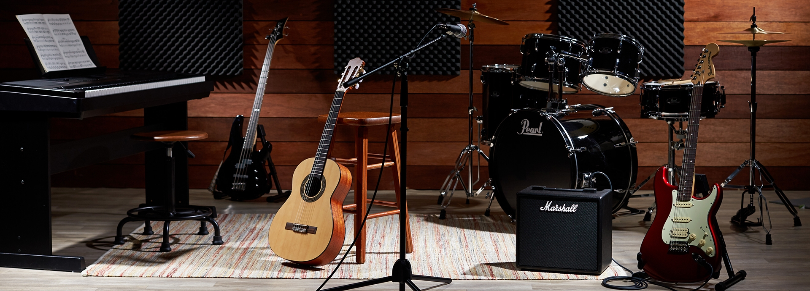
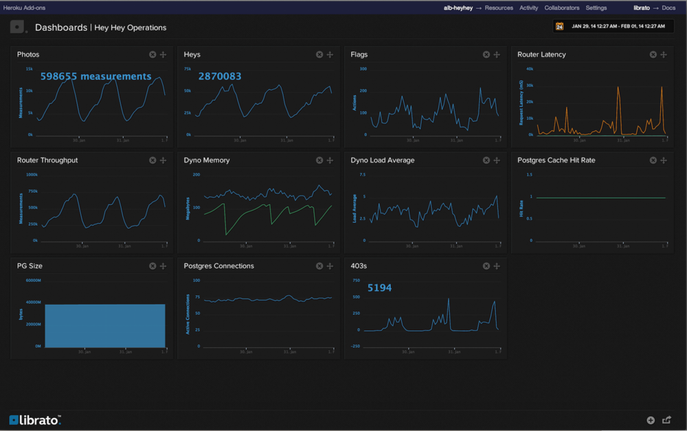

build-lists: true
autoscale: true
footer: *@jagthedrummer*
slidenumbers: false

#[fit] Better Code
# through
#[fit] Instrumentation


---

# Many people don't know this, but...

---



#[fit] Code responds to Music[^*]

[^*]: Especially drums, for some reason.

---


# IT'S TRUE![^**]

[^**]: It's not true.

---


# Ok, no more jokes[^***]

[^***]: Maybe true.

---


# Instrumentation

---



# Use Case

## Generating Data for a Dashboard

---

# Let's focus on what makes our app unique and leave data visualization to somebody else (like Librato)

---

# First Draft

`app/controllers/photos_controller.rb`

```ruby
def create
  @photo = current_account.photos.new(photo_params)


  respond_to do |format|
    # ...
  end
end
```
---

# First Draft

`app/controllers/photos_controller.rb`

```ruby, [.highlight: 4]
def create
  @photo = current_account.photos.new(photo_params)

  Librato.increment 'photo.create', sporadic: true

  respond_to do |format|
    # ...
  end
end
```

---

# Comments on this approach

* Violates Single Responsibility Principle
* Complicates development and testing

---

# Second Draft

`app/models/photo.rb`

```ruby
class Photo < ApplicationRecord


end
```

---

# Second Draft

`app/models/photo.rb`

```ruby, [.highlight: 3]
class Photo < ApplicationRecord

  after_create { Librato.increment 'photo.create', sporadic: true }

end
```
---

# Comments on this approach

* Still Violates Single Responsibility Principle
* Complicates development and testing even more


---

# Third Draft

`app/services/photo_creation_service.rb`

```ruby
class PhotoCreationService
  def self.call(photo_params, current_account)

    photo = current_account.photos.create(photo_params)


    return photo

  end
end
```
---

# Third Draft

`app/services/photo_creation_service.rb`

```ruby, [.highlight: 6]
class PhotoCreationService
  def self.call(photo_params, current_account)

    photo = current_account.photos.create(photo_params)

    Librato.increment 'photo.create', sporadic: true

    return photo

  end
end
```
---

# Comments on this approach

* Better on SRP
* Still complicates development and testing

---

# What if we didn't have to find a place _inside_ our existing code base to be able to watch it?

---

#[fit] ActiveSupport::Notifications

---

# Fourth Draft

`config/initializers/instrumentation.rb`

```ruby
ActiveSupport::Notifications.subscribe "sql.active_record" do |*args|


end
```

---

# Fourth Draft

`config/initializers/instrumentation.rb`

```ruby, [.highlight: 3]
ActiveSupport::Notifications.subscribe "sql.active_record" do |*args|

  event = ActiveSupport::Notifications::Event.new(*args)


end
```

---

# Fourth Draft [^****]

`config/initializers/instrumentation.rb`

```ruby, [.highlight: 5-7]
ActiveSupport::Notifications.subscribe "sql.active_record" do |*args|

  event = ActiveSupport::Notifications::Event.new(*args)

  if event.payload[:name] == "Photo Create"
    Librato.increment 'photo.create', sporadic: true
  end

end
```

[^****]: This will work in Rails 5.2.0 - <https://github.com/rails/rails/pull/30619>

---

# Comments on this approach

* Even better on SRP
* Still complicates development and testing

---

# Final Draft

`config/initializers/instrumentation.rb`

```ruby
if ENV['LIBRATO_USER'] && ENV['LIBRATO_KEY']
  ActiveSupport::Notifications.subscribe "sql.active_record" do |*args|
    #...
  end
end
```
---

# Comments on this approach

* Still good on SRP
* Good on development and testing

---

# Create Custom Events

---

## Somewhere in your code:

```ruby
payload = { :user => current_user }
ActiveSupport::Notifications.instrument "my.custom.event", payload do
  # do your custom stuff here
end
```

* Notification sent when block returns
* AS::N captures start/end times
* and generates a unique id

---


#[fit] Thanks!

Jeremy Green

Consultant, Author, SaaSer


www.octolabs.com

@jagthedrummer

jeremy@octolabs.com

